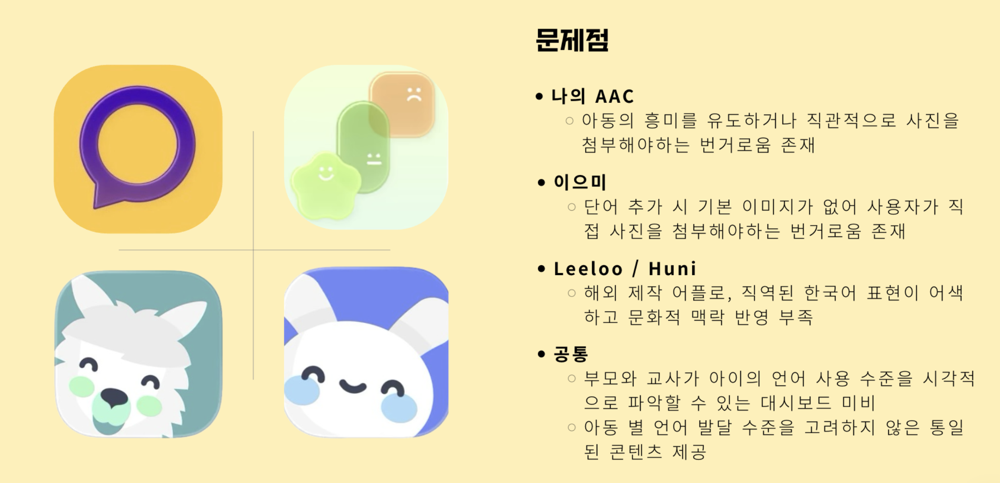
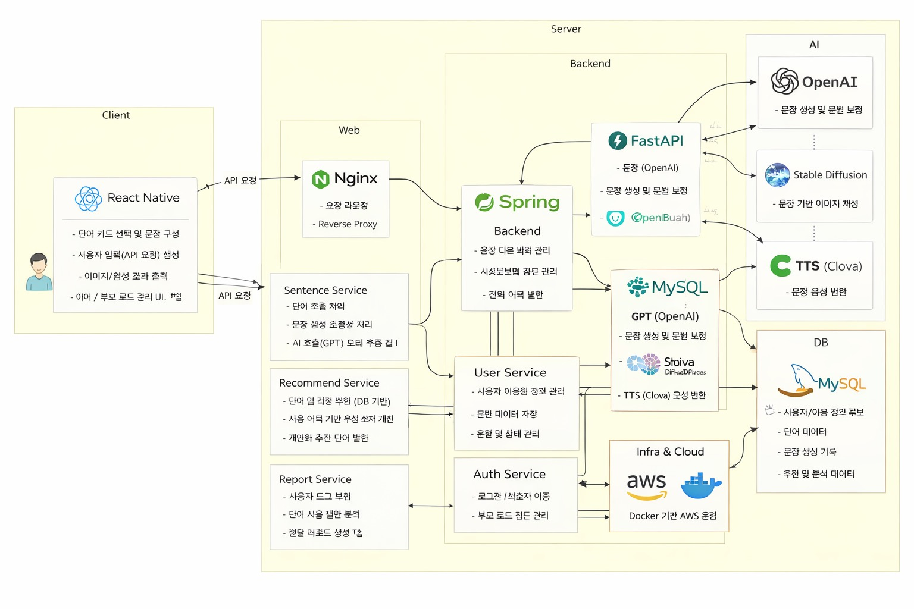
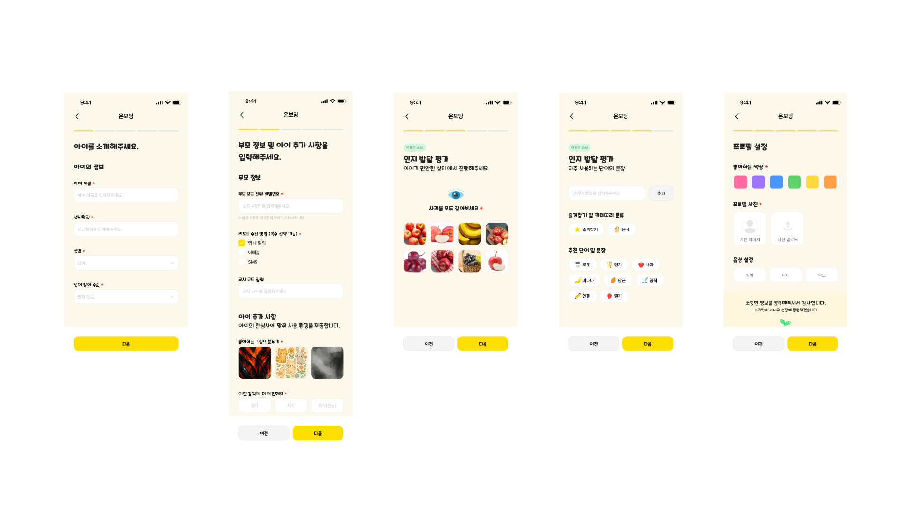
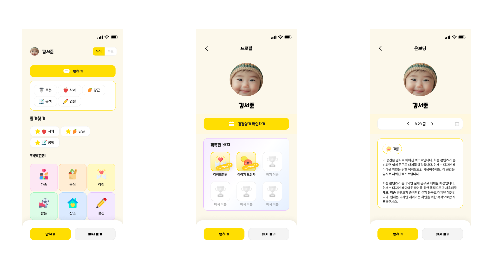
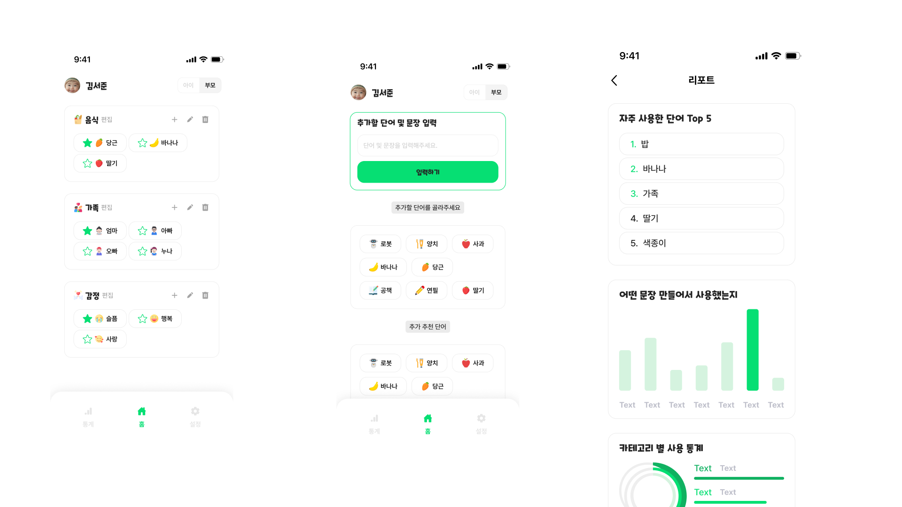

# 1. Team Info

### 1.1 과제명

무발화 자폐 아동의 의사표현 어려움 해소를 위한 AI 기반 개인맞춤형 의사소통 어플리케이션  - 단어 확장, 이미지 생성, 음성 출력, 데이터 분석을 통해 문장 생성 및 표현을 지원하는 서비스

### 1.2 팀정보

**36팀 이게되네**

### 1.3 팀 구성원

| 이름   | 역할                    | 담당 분야                                 |
| ------ | ----------------------- | ----------------------------------------- |
| 최혜원 | 팀장, 백엔드, AI        | AI 모델 설계 및 데이터 분석 로직 구현     |
| 안례진 | 백엔드, AI              | FastAPI 서버, 데이터베이스 및 AI API 연동 |
| 양승혜 | 프론트엔드, UI/UX, 기획 | React Native 앱 UI 개발 및 인터랙션 설계  |

  

# 2. Project-Summary

| 항목                  | 내용                                                                                                                                                                                                                                                                                                                                                                                                                                                                                                                                                                                                                                                                                                                                                                                                                                                                                                                                                                                                                                                                                                                                                                                                                                                                                                                                                                                                                                                                                                                                                                                                                                                                                                                                                                                                                                                                                                                                                                                                                                                                                                                                                                                                                                                                                                                                                                                                                                                                                                                                                                                                                                                                                                                                                                                                                                                                                                                                                                                                                                                                                                                                                                                                                                                                                                                                                                                                                                                                                                                                                                                                                                                                                                                                                                                                                                                                                                                                                                  |
| :-------------------- | :-------------------------------------------------------------------------------------------------------------------------------------------------------------------------------------------------------------------------------------------------------------------------------------------------------------------------------------------------------------------------------------------------------------------------------------------------------------------------------------------------------------------------------------------------------------------------------------------------------------------------------------------------------------------------------------------------------------------------------------------------------------------------------------------------------------------------------------------------------------------------------------------------------------------------------------------------------------------------------------------------------------------------------------------------------------------------------------------------------------------------------------------------------------------------------------------------------------------------------------------------------------------------------------------------------------------------------------------------------------------------------------------------------------------------------------------------------------------------------------------------------------------------------------------------------------------------------------------------------------------------------------------------------------------------------------------------------------------------------------------------------------------------------------------------------------------------------------------------------------------------------------------------------------------------------------------------------------------------------------------------------------------------------------------------------------------------------------------------------------------------------------------------------------------------------------------------------------------------------------------------------------------------------------------------------------------------------------------------------------------------------------------------------------------------------------------------------------------------------------------------------------------------------------------------------------------------------------------------------------------------------------------------------------------------------------------------------------------------------------------------------------------------------------------------------------------------------------------------------------------------------------------------------------------------------------------------------------------------------------------------------------------------------------------------------------------------------------------------------------------------------------------------------------------------------------------------------------------------------------------------------------------------------------------------------------------------------------------------------------------------------------------------------------------------------------------------------------------------------------------------------------------------------------------------------------------------------------------------------------------------------------------------------------------------------------------------------------------------------------------------------------------------------------------------------------------------------------------------------------------------------------------------------------------------------------------------------------------- |
| (1) 문제 정의         | **[문제 정의 및 배경]** 현대 사회에서 의사소통은 개인의 감정 표현과 사회적 관계 형성에 있어 필수적인 요소이다. 그러나 자폐 스펙트럼 장애를 가진 아동 중 약 25~35%는 언어를 통한 의사표현이 어려운 무발화(minimally verbal) 상태에 놓여 있으며, 이들은 자신의 욕구나 감정을 적절히 전달하는 데 큰 어려움을 겪는다. 이러한 아동들은 단어의 의미를 어느 정도 이해하고 있음에도 불구하고, 이를 문장으로 구성하거나 음성으로 표현하는 과정에서 제약을 받으며, 그 결과 일상적인 의사소통에서 소외되는 경험을 반복하게 된다. 이는 단순한 불편함을 넘어 사회적 고립과 정서적 스트레스로 이어질 수 있는 중요한 문제이다.  현재 이러한 문제를 해결하기 위해 활용되는 대표적인 보조 도구로는 PECS(Picture Exchange Communication System)가 존재한다. 이는 그림 카드를 조합하여 문장을 구성하는 방식으로, 시각적 이해 능력이 높은 자폐 아동에게 일정 부분 효과적인 도구로 사용되어 왔다. 그러나 PECS는 카드 제작 및 관리의 번거로움, 상황별 단어 확장의 어려움, 개인별 언어 수준을 반영하지 못하는 한계, 그리고 실시간 의사소통 대응의 어려움 등 여러 구조적 문제를 가지고 있다.   또한 기존 AAC 어플리케이션 역시 이미지 직접 첨부의 번거로움, 어색한 번역 기반 언어, 보호자용 데이터 분석 기능의 부족 등으로 인해 아동과 보호자 모두에게 완전한 해결책이 되지 못하고 있다. 특히 대부분의 서비스가 아동의 발달 수준과 선호도를 충분히 반영하지 못하고, 동일한 콘텐츠를 제공한다는 점에서 개인화 부족 문제가 두드러진다.   따라서 본 프로젝트는 이러한 문제를 해결하기 위해, 무발화 자폐 아동의 개인차를 반영하고, 실시간 의사표현을 지원하며, 데이터 기반으로 발달을 분석할 수 있는 새로운 형태의 의사소통 플랫폼의 필요성에서 출발하였다.  **[Pain Points]** 본 프로젝트에서 정의한 주요 문제점은 다음과 같다. 1. 아동의 개인차를 충분히 반영하지 못하는 문제이다. 무발화 자폐 아동은 각기 다른 언어 이해 수준과 표현 능력을 가지고 있음에도 불구하고, 기존 도구들은 동일한 단어 세트와 콘텐츠를 제공하여 개인별 학습 효과를 저하시킨다. 2. 지속적인 사용을 유도하기 어려운 구조이다. 기존 콘텐츠는 반복적이고 정적인 형태로 구성되어 있어 아동의 흥미를 유지하기 어렵고, 자발적인 사용 동기를 충분히 제공하지 못한다. 3.물리적 제약으로 인한 접근성 문제이다. PECS와 같은 방식은 카드 제작 및 휴대가 필수적이기 때문에 사용 환경에 제약이 존재하며, 즉각적인 의사소통이 어려운 구조를 가진다. 4. 데이터 기반 피드백의 부재이다. 기존 시스템에서는 아동의 사용 기록을 체계적으로 분석하지 못하기 때문에, 부모와 교사가 아동의 발달 추이나 변화 양상을 객관적으로 파악하기 어렵다.  이러한 문제들은 단순히 사용성의 불편함을 넘어, 아동의 표현 기회를 제한하고 장기적인 발달에도 영향을 미칠 수 있다는 점에서 해결이 필요한 핵심 과제로 정의하였다.                                                                                                                                                                                                                                                                                                                                                                                                                                                                                                                                                                                                                                                                                                                                                                                                                                                                                                                                                                                                                                                                                                                                                                                                                                                                              |
| (2) 기존연구와의 비교 | 현재 무발화 자폐 아동의 의사소통을 지원하기 위한 대표적인 방식으로는 PECS(Picture Exchange Communication System)와 다양한 AAC(Augmentative and Alternative Communication) 애플리케이션이 활용되고 있다.  먼저 PECS는 그림 카드를 활용하여 명사와 서술어를 조합함으로써 문장을 구성하는 방식으로, 시각적 이해 능력이 높은 자폐 아동에게 일정 수준 효과적인 의사소통 수단으로 사용되어 왔다. 그러나 해당 방식은 물리적인 카드 제작과 관리가 필수적이며, 상황에 맞는 단어를 지속적으로 확장하기 어렵다는 한계를 가진다. 또한 아동의 발달 수준이나 개인별 언어 특성을 반영하기 어려워 동일한 방식의 표현만을 반복하게 되는 구조적 제약이 존재한다. 더불어 사용 과정에서 발생하는 데이터가 체계적으로 축적되지 않기 때문에, 아동의 의사소통 변화나 발달 추이를 분석하는 데에도 한계가 있다.  한편,기존 AAC 애플리케이션은 이러한 물리적 한계를 보완하기 위해 디지털 기반으로 단어 선택 및 문장 구성을 지원하는 형태로 발전하였다. 그러나 대부분의 서비스는 정적인 단어 배열과 제한된 콘텐츠 구조를 기반으로 운영되고 있으며, 아동의 개인차를 충분히 반영하지 못한다는 문제가 존재한다. 특히 사용자의 선택 이력이나 선호도를 반영한 개인화 기능이 부족하고, 데이터 기반 분석 및 피드백 기능이 미흡하여 보호자와 교사가 아동의 발달 상태를 객관적으로 파악하기 어렵다. 또한 반복적이고 단조로운 인터페이스 구조로 인해 아동의 흥미를 지속적으로 유지하기 어렵다는 점 역시 중요한 한계로 지적된다.  결과적으로 기존 PECS 및 AAC 시스템은 의사소통 보조 도구로서의 기본적인 기능은 수행하고 있으나, 개인화, 확장성, 데이터 활용 측면에서 구조적인 한계를 가지고 있다. 따라서 아동의 사용 맥락과 발달 과정을 반영하고, 실시간 의사표현을 지원하며, 데이터 기반으로 분석 및 피드백이 가능한 새로운 형태의 의사소통 플랫폼이 필요하다.                                                                                                                                                                                                                                                                                                                                                                                                                                                                                                                                                                                                                                                                                                                                                                                                                                                                                                                                                                                                                                                                                                                                                                                                                                                                                                                                                                                                                                                                                                                                                                                                                                                                                                                                                                                                                                                                                                                                                                                                                                                                                                                                                                       |
| (3) 제안 내용         | 본 프로젝트는 무발화 자폐 아동의 의사표현을 지원하기 위해 AI 기반 개인맞춤형 의사소통 플랫폼 **소리싹**을 제안한다. 해당 플랫폼은 단어 선택부터 문장 생성, 이미지 생성, 음성 출력, 데이터 분석까지 하나의 흐름으로 연결된 통합 구조를 가진다.   먼저, 아동은 직관적인 카드형 인터페이스를 통해 단어를 선택하거나 직접 새로운 단어를 추가할 수 있다. 이 과정에서 AI는 해당 단어와 연관된 명사, 동사, 형용사를 자동으로 추천하여 문장 구성을 지원한다. 이를 통해 아동은 단순한 단어 선택을 넘어 자연스러운 문장 표현을 경험할 수 있다.  또한 생성된 문장은 Stable Diffusion 기반 이미지와 Clova Voice 기반 음성으로 동시에 출력되어, 시각적·청각적 피드백을 제공한다. 이는 아동이 자신의 표현을 직관적으로 이해하고, 표현 과정 자체를 즐겁게 경험할 수 있도록 돕는다. 더불어, 사용 과정에서 축적된 데이터는 아동의 언어 사용 패턴, 표현 빈도, 감정 변화 등을 분석하는 데 활용되며, 이를 기반으로 부모와 교사에게 발달 리포트가 제공된다. 이러한 데이터 기반 피드백은 아동의 성장 과정을 객관적으로 파악하고, 맞춤형 교육 및 돌봄 방향을 설정하는 데 중요한 역할을 한다. 마지막으로 캐릭터, 배지, 보상 시스템 등 게이미피케이션 요소를 도입하여 아동의 흥미를 유도하고 지속적인 사용을 촉진함으로써, 단순한 기능 제공을 넘어 장기적인 학습과 표현 경험을 지원하는 플랫폼을 지향한다.                                                                                                                                                                                                                                                                                                                                                                                                                                                                                                                                                                                                                                                                                                                                                                                                                                                                                                                                                                                                                                                                                                                                                                                                                                                                                                                                                                                                                                                                                                                                                                                                                                                                                                                                                                                                                                                                                                                                                                                                                                                                                                                                                                                                                                                                                                                                                                                                                                                                                                                                                                                                                                                                   |
| (4) 기대효과 및 의의  | 본 프로젝트는 무발화 자폐 아동의 의사소통 문제를 해결함으로써, 개인,교육,사회적 측면에서 다음과 같은 효과를 기대할 수 있다.  첫째, 아동의 자기 표현 능력 향상이다. 기존에는 단어 단위의 제한된 표현이나 보호자의 추측에 의존하던 의사소통 방식에서 벗어나, AI 기반 문장 생성과 음성 출력 기능을 통해 아동이 자신의 감정과 욕구를 보다 명확하고 구체적인 문장 형태로 전달할 수 있다. 특히 단어 선택 시 연관 표현이 자동으로 추천되고 문장이 자연스럽게 완성되는 구조는 아동이 반복적인 사용을 통해 문장 구성 경험을 축적하도록 돕는다. 이는 단순한 의사 전달을 넘어 언어 표현 능력의 점진적인 확장으로 이어지며, 결과적으로 사회적 상호작용 기회 증가와 정서적 안정에 긍정적인 영향을 미칠 수 있다.  둘째, 보호자의 이해도 향상 및 맞춤형 양육 지원 가능성이다. 아동의 단어 선택, 문장 생성, 감정 표현 데이터는 자동으로 기록 및 분석되어 발달 리포트 형태로 제공된다. 보호자는 이를 통해 “어떤 단어를 자주 사용하는지”, “어떤 상황에서 표현이 증가하거나 감소하는지”, “감정 표현의 변화는 어떠한지”를 객관적으로 파악할 수 있다. 또한 해당 리포트를 PDF 형태로 변환하여 교사나 치료사에게 전달함으로써, 가정과 교육 환경 간의 정보 단절을 최소화하고 일관된 방향의 상호작용 및 교육 전략 수립이 가능해진다.  셋째, 기존 AAC 도구의 구조적 한계를 개선하는 새로운 의사소통 방식 제시이다. 물리적 카드 기반 시스템에서 발생하는 제작 및 휴대의 불편함을 제거하고, 디지털 환경에서 단어 확장, 문장 생성, 이미지 및 음성 출력까지 실시간으로 이루어지는 통합적 구조를 제공한다. 특히 생성형 AI를 활용한 개인화된 단어 추천과 문장 구성은 기존의 정적인 콘텐츠 제공 방식과 달리, 아동의 발달 수준과 사용 패턴에 따라 지속적으로 변화하는 동적 시스템이라는 점에서 차별성을 가진다.  넷째, 지속 가능한 사용 환경 및 학습 동기 유도이다. 캐릭터, 배지, 애니메이션 등 게이미피케이션 요소를 통해 아동이 의사표현 과정을 놀이처럼 인식하도록 유도하며, 표현 행동에 대한 즉각적인 시각·청각 피드백을 제공한다. 이는 단순한 기능 사용을 넘어 아동의 자발적인 참여를 이끌어내고, 장기적인 서비스 이용과 반복 학습을 가능하게 한다. 특히 표현 결과가 즉시 반영되는 인터랙션 구조는 아동에게 성취감을 제공하여 지속적인 사용 동기를 강화하는 역할을 한다.  다섯째, 데이터 기반 발달 지원 체계 구축 가능성이다. 아동의 모든 의사소통 활동이 데이터로 축적되고 분석됨에 따라, 단순한 기록을 넘어 발달 패턴을 정량적으로 추적할 수 있는 기반이 마련된다. 이는 향후 개인 맞춤형 학습 방향 제안, 표현 능력 향상 전략 도출, 나아가 발달 데이터셋 구축 및 연구 확장으로까지 이어질 수 있는 가능성을 가진다.  궁극적으로 본 프로젝트는 단순한 학습 도구를 넘어, 무발화 자폐 아동이 자신의 방식으로 세상과 소통할 수 있도록 돕는 AI 기반 AAC 시스템으로서의 의의를 가진다. 특히 “표현을 대신해주는 도구”가 아니라 “표현을 가능하게 만드는 환경”을 제공한다는 점에서, 기술이 사회적 약자의 의사소통 권리를 확장하는 데 기여하는 의미 있는 사례가 될 수 있을 것이다.                                                                                                                                                                                                                                                                                                                                                                                                                                                                                                                                                                                                                                                                                                                                                                                                                                                                                                                                                                                                                                                                                       |
| (5) 주요 기능 리스트  | 1) AI 기반 단어 확장 및 문장 생성 본 기능은 무발화 자폐 아동이 단어 단위의 이해에서 문장 단위의 표현으로 확장할 수 있도록 돕는 핵심 기능이다. 사용자가 특정 단어를 선택하거나 입력하면, 생성형 AI 모델이 해당 단어와 의미적으로 연관된 명사, 동사, 형용사를 자동으로 추천한다. 이때 추천되는 단어는 단순한 사전적 연관성이 아닌, 사용자의 이전 사용 기록과 선호 패턴을 반영하여 개인화된 형태로 제공된다.또한 선택된 단어들은 문맥에 맞게 자동으로 조합되어 자연스러운 문장으로 생성되며, 문법적으로 부자연스러운 표현은 AI가 자동으로 보정한다. 예를 들어 “사과”라는 단어를 선택할 경우 “먹고 싶어요”, “주세요”, “맛있어요” 등의 표현이 함께 추천되고, 이를 통해 “사과 먹고 싶어요”와 같은 문장이 생성된다.  2) 이미지 생성 및 음성 출력 본 기능은 아동의 표현을 시각적·청각적으로 확장하여 이해도와 몰입도를 동시에 높이기 위한 멀티모달 표현 시스템이다. 사용자가 생성한 문장은 AI 기반 이미지 생성 모델을 통해 의미에 맞는 아동 친화적인 이미지로 변환되며, 동시에 TTS(Text-to-Speech) 기술을 활용하여 자연스러운 음성으로 출력된다.이미지는 단순한 아이콘이 아닌 문장의 의미를 반영한 장면 형태로 생성되어, 아동이 자신의 표현을 직관적으로 이해할 수 있도록 돕는다. 음성 출력의 경우, 속도, 톤, 성별 등을 조절할 수 있어 아동의 선호와 이해 수준에 맞춘 개인화된 발화 경험을 제공한다.  3) 개인 맞춤 온보딩 본 기능은 서비스 사용 초기 단계에서 아동의 특성을 반영하여 개인화된 환경을 구성하기 위한 기능이다. 보호자는 온보딩 과정에서 아동의 언어 발달 수준, 감정 표현 정도, 자주 사용하는 단어 등을 입력하게 되며, 해당 정보는 이후 모든 추천 및 기능의 기준 데이터로 활용된다. 또한 아동의 사진을 기반으로 AI가 유사한 캐릭터를 생성하여, 아동이 자신과 연결된 아바타를 통해 의사소통을 진행할 수 있도록 한다. 이는 아동이 서비스에 대한 심리적 거리감을 줄이고, 더 높은 몰입도를 느낄 수 있도록 설계된 요소이다.  4) 데이터 분석 및 리포트 본 기능은 아동의 사용 데이터를 기반으로 언어 발달 패턴과 변화를 분석하고, 이를 보호자와 교사에게 제공하는 기능이다. 아동이 선택한 단어, 생성한 문장, 사용 빈도, 감정 표현 유형 등의 데이터는 지속적으로 저장되며, 이를 기반으로 다양한 지표가 도출된다. 예를 들어 자주 사용하는 단어 Top5, 문장 길이 변화, 감정 표현 비율, 특정 상황에서의 표현 패턴 등이 분석되며, 이러한 정보는 시각화된 그래프와 함께 리포트 형태로 제공된다. 또한 AI는 분석 결과를 바탕으로 “어떤 표현이 부족한지”, “어떤 방향으로 확장해야 하는지”에 대한 피드백을 함께 제시한다.  5) 부모 중심 데이터 관리 및 리포트 공유 가능 본 기능은 아동의 의사소통 데이터를 보호자가 중심이 되어 관리하고, 필요 시 이를 교사와 공유할 수 있도록 지원하는 기능이다. 기존에는 부모와 교사를 각각 위한 별도의 인터페이스를 제공하는 구조를 고려하였으나, 서비스의 단순성과 실제 사용 흐름을 고려하여 부모 중심의 관리 구조로 재설계하였다. 아동이 앱을 사용하면서 생성한 단어 선택 기록, 문장 생성 데이터, 감정 표현 패턴 등은 모두 자동으로 축적되며, 이를 기반으로 주간 또는 월간 단위의 발달 리포트가 생성된다. 해당 리포트에는 자주 사용하는 단어, 표현 유형 변화, 문장 생성 빈도, 감정 표현 경향 등 아동의 의사소통 패턴이 시각적으로 정리되어 제공된다.보호자는 이 리포트를 앱 내에서 확인할 수 있을 뿐만 아니라, 이를 PDF 형태로 변환하여 외부로 공유할 수 있다. 이를 통해 보호자는 교사나 치료사에게 아동의 최근 상태와 변화를 전달할 수 있으며, 별도의 시스템 없이도 가정과 교육 환경 간의 정보 연결이 가능해진다.  6) 보상 시스템: 캐릭터, 배지 등을 통한 동기부여 및 지속 사용 유도 본 기능은 아동의 지속적인 사용을 유도하고 표현 활동을 강화하기 위한 게이미피케이션 요소이다. 아동이 단어를 선택하거나 문장을 생성할 때마다 캐릭터의 반응, 애니메이션, 배지 획득 등의 보상이 제공되며, 이는 표현 행동에 대한 긍정적 피드백으로 작용한다.특히 캐릭터는 단순한 시각 요소를 넘어, 아동의 감정 표현을 함께 보여주는 역할을 하며, 사용 횟수나 새로운 표현 학습에 따라 다양한 보상이 제공된다. 이를 통해 아동은 의사소통 자체를 “놀이 경험”으로 인식하게 되고, 자발적인 참여를 지속할 수 있다. |

# 3. Project-Design & Implementation

| 항목                       | 내용                                                                                                                                                                                                                                                                                                                                                                                                                                                                                                                                                                                                                                                                                                                                                                                                                                                                                                                                                                                                                                                                                                                                                                                                                                                                                                                                                                                                                                                                                                                                                                                                                                                                                                                                                                                                                                                                                                                                                                                                                                                                                                                                                                                                                                                                                                                                                                                                                                                                                                                                                                                                                                                                                                                                                                                                                                                                                                                                                                                                                                                                                                                                                                                                                                                                                                                                                                                                                                                                                                                                                                                                                                                                                                                                                                                                                                                                                                                                                                                                                                                                                                                                          |
| :------------------------- | :-------------------------------------------------------------------------------------------------------------------------------------------------------------------------------------------------------------------------------------------------------------------------------------------------------------------------------------------------------------------------------------------------------------------------------------------------------------------------------------------------------------------------------------------------------------------------------------------------------------------------------------------------------------------------------------------------------------------------------------------------------------------------------------------------------------------------------------------------------------------------------------------------------------------------------------------------------------------------------------------------------------------------------------------------------------------------------------------------------------------------------------------------------------------------------------------------------------------------------------------------------------------------------------------------------------------------------------------------------------------------------------------------------------------------------------------------------------------------------------------------------------------------------------------------------------------------------------------------------------------------------------------------------------------------------------------------------------------------------------------------------------------------------------------------------------------------------------------------------------------------------------------------------------------------------------------------------------------------------------------------------------------------------------------------------------------------------------------------------------------------------------------------------------------------------------------------------------------------------------------------------------------------------------------------------------------------------------------------------------------------------------------------------------------------------------------------------------------------------------------------------------------------------------------------------------------------------------------------------------------------------------------------------------------------------------------------------------------------------------------------------------------------------------------------------------------------------------------------------------------------------------------------------------------------------------------------------------------------------------------------------------------------------------------------------------------------------------------------------------------------------------------------------------------------------------------------------------------------------------------------------------------------------------------------------------------------------------------------------------------------------------------------------------------------------------------------------------------------------------------------------------------------------------------------------------------------------------------------------------------------------------------------------------------------------------------------------------------------------------------------------------------------------------------------------------------------------------------------------------------------------------------------------------------------------------------------------------------------------------------------------------------------------------------------------------------------------------------------------------------------------------------- |
| (1) 요구사항 정의          | 본 프로젝트는 무발화 자폐 아동의 의사소통을 지원하는 플랫폼으로서, 단순 기능 제공을 넘어 실제 사용 환경에서의 접근성, 직관성, 개인화, 그리고 데이터 기반 분석까지 고려한 요구사항을 정의하였다. 우선 사용자 요구사항은 아동과 보호자의 두 가지 관점으로 구분하였다. 아동의 경우, 최소한의 입력으로 자신의 의사를 표현할 수 있어야 하며, 복잡한 조작 없이 직관적으로 사용할 수 있는 인터페이스가 요구된다. 또한 반복적인 사용을 유도하기 위해 시각적·청각적 피드백이 즉각적으로 제공되어야 하며, 표현 과정 자체가 흥미로운 경험으로 느껴질 수 있어야 한다.보호자의 경우, 아동의 의사소통 데이터를 기반으로 발달 상태를 객관적으로 파악할 수 있는 기능이 필요하다. 단순한 기록이 아닌, 패턴 분석과 변화 추이를 확인할 수 있는 리포트 제공이 요구되며, 해당 데이터를 외부(교사, 치료사 등)와 공유할 수 있는 기능 또한 중요한 요구사항으로 정의되었다.  기능적 요구사항은 다음과 같다. 첫째, 단어 선택 및 추가를 기반으로 한 문장 생성 기능 둘째, 생성된 문장의 이미지 및 음성 출력 기능 셋째, 사용자 데이터를 기반으로 한 단어 추천 및 개인화 기능 넷째, 사용 로그 저장 및 발달 분석 리포트 생성 기능 다섯째, 리포트의 PDF 변환 및 외부 공유 기능  비기능적 요구사항으로는 아동 친화적 UI/UX, 빠른 응답 속도, 안정적인 데이터 저장 및 처리, 그리고 AI 모델과의 실시간 연동이 포함된다. 특히 UI/UX는 색상 대비, 큰 버튼, 단순한 인터랙션 구조 등 인지 특성을 고려하여 설계되어야 한다는 점을 중요하게 반영하였다.                                                                                                                                                                                                                                                                                                                                                                                                                                                                                                                                                                                                                                                                                                                                                                                                                                                                                                                                                                                                                                                                                                                                                                                                                                                                                                                                                                                                                                                                                                                                                                                                                                                                                                                                                                                                                                                                                                                                                                                                                                                                                                                                                                                                                                                                                                                                                                                                                                                                                                                                                                                                                                                                                                      |
| (2) 전체 시스템 구성       | 본 시스템은 Frontend, Backend, AI 모듈, Database, Cloud 인프라로 구성된다.  Frontend는 React Native + Expo 기반으로 구현되며, 아동이 직접 상호작용하는 카드형 UI를 통해 단어 선택, 문장 생성, 음성 출력 등의 기능을 제공한다.  Backend는 Spring 기반 서버로 구성되며, 사용자 요청 처리, 데이터 저장, AI 모듈과의 통신을 담당한다.  AI 모듈은 GPT 기반 문장 생성 및 단어 확장, Stable Diffusion 이미지 생성, Clova Voice 기반 음성 출력 기능을 수행한다.  Database는 MySQL 및 Firebase를 활용하여 사용자 정보, 단어, 문장, 로그 데이터를 저장하고 동기화한다.  Cloud 환경은 AWS와 Docker 기반으로 구성되어 서비스의 확장성과 안정성을 확보한다.  전체 흐름은 “사용자 입력 → Frontend → Backend → AI 처리 → 결과 반환 → UI 출력 → 데이터 저장” 구조로 실시간 처리된다.                                                                                                                                                                                                                                                                                                                                                                                                                                                                                                                                                                                                                                                                                                                                                                                                                                                                                                                                                                                                                                                                                                                                                                                                                                                                                                                                                                                                                                                                                                                                                                                                                                                                                                                                                                                                                                                                                                                                                                                                                                                                                                                                                                                                                                                                                                                                                                                                                                                                                                                                                                                                                                                                                                                                                                                                                                                                                                                                                                                                                                                                                                                                                                                                                                                                               |
| (3) 주요 엔진 및 기능 설계 | 본 프로젝트는 세 가지 핵심 엔진을 중심으로 설계되었다.  [AI 기반 문장 생성 및 단어 확장] 아동의 단어 선택을 기반으로 문장을 생성하고 표현을 확장하는 역할을 한다. 입력(Input)은 아동이 선택하거나 입력한 단어와 사용자 개인 데이터(발달 수준, 선호 단어 등)이며, 내부 로직에서는 해당 데이터를 기반으로 GPT 모델이 연관 단어를 추천하고 문장을 생성한다. 이 과정에서 문법 보정과 문맥 연결이 함께 수행된다. 출력(Output)은 자연스러운 문장과 추가 추천 단어 리스트이며, 이는 즉시 UI에 반영된다. 이 엔진은 단순한 카드 조합을 넘어, 아동의 표현 범위를 동적으로 확장하는 핵심 기능으로 작동하며, 반복 사용을 통해 개인화 정확도가 점차 향상된다.  [이미지·음성 통합 표현] 생성된 문장을 시각적·청각적 표현으로 변환하는 역할을 한다. 입력(Input)은 AI가 생성한 문장이며, 내부 로직에서는 Stable Diffusion을 통해 해당 문장에 맞는 이미지를 생성하고, Clova Voice TTS를 통해 음성으로 변환한다. 출력(Output)은 이미지와 음성이 결합된 멀티모달 표현 결과이며, 이는 UI에서 캐릭터 애니메이션과 함께 사용자에게 제공된다. 이 엔진은 아동이 자신의 표현을 직관적으로 이해하고, 표현 경험에 몰입할 수 있도록 돕는 핵심 요소이며, 기존 AAC 도구 대비 높은 사용자 경험을 제공한다.  [데이터 분석 및 리포트 생성] 아동의 사용 데이터를 분석하여 발달 상태를 시각화하고 피드백을 제공하는 역할을 한다. 입력은 아동의 단어 선택 기록, 문장 생성 데이터, 사용 빈도 등의 로그 데이터이며, 내부 로직에서는 pandas 및 scikit-learn을 활용하여 패턴 분석을 수행한다. 분석 결과는 Plotly를 통해 시각화되며, 출력(Output)은 주간/월간 리포트 형태로 제공된다. 해당 리포트는 PDF로 변환되어 보호자가 외부에 공유할 수 있도록 설계되었다. 이 엔진은 단순한 데이터 기록을 넘어, 아동의 성장 과정을 정량적으로 분석하고 향후 학습 방향을 제시하는 데 중요한 역할을 한다.                                                                                                                                                                                                                                                                                                                                                                                                                                                                                                                                                                                                                                                                                                                                                                                                                                                                                                                                                                                                                                                                                                                                                                                                                                                                                                                                                                                                                                                                                                                                                                                                                                                                                                                                                                                                                                                                                                                                                                                                                                                                                                                                                                                                                                                                                                                                                                |
| (4) 주요 기능의 구현       | 본 프로젝트의 주요 기능은 “온보딩 → 표현 → 피드백 → 데이터 축적 → 분석 → 공유”의 흐름을 기반으로 설계되었으며, 각 단계는 아동과 보호자의 실제 사용 경험을 중심으로 구성된다.  **[온보딩 단계: 개인 맞춤 환경 설정]** 무발화 자폐 아동은 각기 다른 언어 발달 수준과 선호도를 가지기 때문에, 동일한 환경을 제공할 경우 사용 효율이 크게 떨어진다. 기존 AAC 도구는 이러한 개인차를 충분히 반영하지 못하고, 획일적인 단어 세트와 인터페이스를 제공하는 한계를 가진다. 이를 해결하기 위해 본 서비스는 온보딩 단계에서 아동의 기본 정보(이름, 나이, 언어 발달 수준 등)와 보호자 정보를 입력받고, 아동의 인지 수준에 맞는 초기 단어 세트와 인터페이스를 구성한다. 또한 AI 기반 추천을 통해 자주 사용할 가능성이 높은 단어를 미리 제안하여 초기 사용 장벽을 낮춘다. 이 과정은 이후 모든 추천 및 분석의 기준 데이터로 활용되며, 서비스 전반의 개인화 정확도를 높이는 핵심 단계로 작용한다.  **[표현 단계: 아동 중심 단어 선택 및 문장 생성]** 무발화 아동은 단어를 알고 있어도 이를 문장으로 구성하는 데 어려움을 겪으며, 기존 PECS 방식에서는 직접 카드를 조합해야 하는 부담이 존재한다. 본 서비스에서는 아동이 메인 화면에서 단어 카드를 선택하면, 해당 입력이 Backend를 통해 AI 엔진으로 전달된다. AI는 선택된 단어를 기반으로 연관 단어를 추천하고, 자연스러운 문장을 자동으로 생성한다. 또한 자주 사용하는 단어는 즐겨찾기 형태로 상단에 배치되어 빠르게 접근할 수 있으며, 카테고리 기반 구조를 통해 상황별 단어 선택이 가능하도록 설계되었다. 이 기능을 통해 아동은 단어 조합에 대한 부담 없이 문장 단위의 표현을 경험할 수 있으며, 반복 사용을 통해 점진적으로 표현 능력을 확장할 수 있다.  **[피드백 단계: 시각·청각 기반 표현 강화]** 단순한 텍스트 출력만으로는 아동이 자신의 표현을 충분히 인지하기 어렵다. 특히 무발화 아동은 시각적·청각적 피드백에 높은 반응을 보이기 때문에, 멀티모달 표현이 필수적이다. 본 서비스는 생성된 문장을 기반으로 이미지 생성 AI를 통해 상황을 시각화하고, TTS를 통해 음성으로 출력한다. 또한 캐릭터를 활용한 애니메이션 반응을 통해 감정 표현을 직관적으로 전달한다. 이러한 구조는 “내가 선택한 표현이 실제로 전달된다”는 경험을 제공하며, 아동의 몰입도와 표현 참여도를 크게 향상시킨다.  **[데이터 축적 단계: 사용자 행동 기반 자동 기록]** 기존 AAC 도구는 사용 데이터를 체계적으로 저장하지 않아, 발달 변화를 객관적으로 파악하기 어렵다. 본 서비스에서는 아동이 단어를 선택하고 문장을 생성하는 모든 과정이 자동으로 기록된다. 수집되는 데이터에는 단어 선택 빈도, 문장 생성 패턴, 감정 표현 유형, 사용 시간 등이 포함되며, 별도의 입력 없이 자연스럽게 축적된다. 이 데이터는 이후 개인화 추천과 발달 분석의 핵심 기반으로 활용된다.  **[분석 단계: 발달 리포트 생성 및 시각화]**  축적된 데이터는 분석 엔진을 통해 처리되어 아동의 언어 사용 패턴과 변화 추이를 도출한다. 리포트에는 자주 사용하는 단어 Top5, 문장 생성 빈도, 감정 표현 변화, 카테고리별 사용 통계 등이 포함되며, 그래프 형태로 시각화되어 보호자가 직관적으로 이해할 수 있도록 제공된다. 또한 AI는 분석 결과를 기반으로 향후 표현 확장을 위한 피드백을 제시하여, 단순 정보 제공을 넘어 실제 행동 개선으로 이어질 수 있도록 설계되었다.   **[공유 단계: PDF 변환 및 외부 전달]** 기존 시스템에서는 보호자와 교사 간의 정보 공유가 제한적이었으며, 별도의 플랫폼이 필요하다는 문제가 있었다. 본 서비스는 생성된 리포트를 PDF 형태로 변환하여 보호자가 직접 교사나 치료사에게 전달할 수 있도록 설계하였다. 이를 통해 별도의 교사용 시스템 없이도 가정과 교육 환경 간의 연계가 가능해진다. 이 구조는 보호자가 중심이 되어 데이터를 관리하고 필요에 따라 공유하는 유연한 협업 방식을 제공하며, 현실적인 사용 환경에 적합한 설계이다.  위 기능들은 “온보딩 → 표현 → 피드백 → 데이터 축적 → 분석 → 공유”의 순환 구조를 형성하며, 사용이 반복될수록 데이터가 누적되고 분석 정확도가 향상된다. 이를 통해 아동은 점진적으로 더 풍부한 표현을 경험하게 되고, 보호자는 데이터 기반으로 발달을 이해할 수 있으며, 결과적으로 의사소통 능력 향상이라는 실질적인 효과로 이어진다. 본 시스템은 단순한 기능 제공을 넘어, 아동의 표현을 지속적으로 확장하는 AI 기반 개인맞춤 의사소통 플랫폼으로서 의미를 가진다. |
