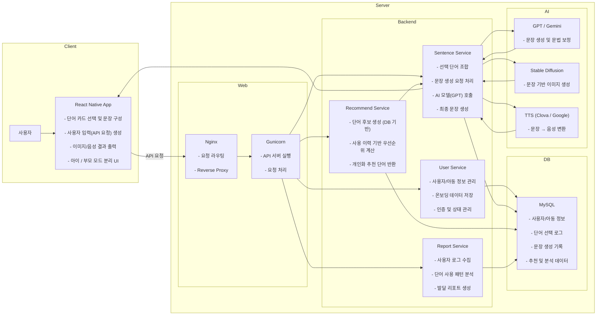

## 1. Team Info

### 1.1 과제명

무발화 자폐 아동의 의사표현 어려움 해소를 위한 AI 기반 개인맞춤형 의사소통 어플리케이션  - 단어 확장, 이미지 생성, 음성 출력, 데이터 분석을 통해 문장 생성 및 표현을 지원하는 서비스

### 1.2 팀정보

**36팀 이게되네**

### 1.3 팀 구성원

| 이름   | 역할                    | 담당 분야                                 |
| ------ | ----------------------- | ----------------------------------------- |
| 최혜원 | 팀장, 백엔드, AI        | AI 모델 설계 및 데이터 분석 로직 구현     |
| 안례진 | 백엔드, AI              | FastAPI 서버, 데이터베이스 및 AI API 연동 |
| 양승혜 | 프론트엔드, UI/UX, 기획 | React Native 앱 UI 개발 및 인터랙션 설계  |

## 2. Project-Summary

# AI 기반 개인맞춤형 의사소통 플랫폼

## 2.1. 과제의 필요성 및 배경 (관련 연구 포함)

### 2.1.1 문제 정의
무발화 자폐 아동은 자신의 감정과 의도를 언어로 표현하는 데 어려움을 겪으며, 이는 사회적 상호작용과 학습 전반에 영향을 미친다. 

특히 자폐 아동 중 약 25~35%는 무발화 수준에 해당하며, 기존 의사소통 방식으로는 충분한 표현이 어렵다. :contentReference[oaicite:1]{index=1}  

---

### 2.1.2 기존 연구 및 한계 (PECS, AAC 비교)

#### (1) PECS (Picture Exchange Communication System)
- 그림 카드 기반 의사소통 방식
- 명사 + 서술어를 조합하여 문장 생성

**한계**
- 물리적 카드 제작 및 휴대 필요
- 상황별 단어 부족
- 개인화 어려움
- 데이터 축적 및 분석 불가

#### (2) 기존 AAC 앱
- 디지털화된 카드 기반 시스템
- 정적 콘텐츠 중심

**한계**
- 개인별 발달 수준 반영 부족
- 데이터 기반 피드백 부재
- 흥미 유지 어려움

---

### 2.1.3 본 과제의 필요성

기존 시스템은 “단어 선택 도구”에 머물러 있으며, 다음과 같은 문제가 존재한다:

- 개인 맞춤형 의사소통 지원 부족
- 데이터 기반 발달 분석 부재
- 동기 부여 요소 부족
- 실시간 확장 가능한 표현 시스템 부재

-> 따라서 **AI 기반 개인맞춤형 의사소통 플랫폼**이 필요하다.

---

### 2.1.4 프로젝트 목표

본 과제의 목표는 다음과 같다:

- 개인화된 단어 추천 및 문장 생성
- 이미지 + 음성 기반 멀티모달 표현 제공
- 사용자 데이터 기반 발달 분석 및 리포트 생성
- 보호자·교사 연계 피드백 시스템 구축

---

## 2.2. 과제의 최종 산출물

### 2.2.1 최종 산출물 정의

본 프로젝트의 최종 산출물은 다음과 같다:

1. **모바일 애플리케이션 (React Native)**
   - 아동용 의사표현 인터페이스
   - 단어 선택 및 문장 생성 기능

2. **AI 기반 기능**
   - 단어 추천 및 문장 생성 (GPT/Gemini)
   - 이미지 생성 (Stable Diffusion / DALL·E)
   - 음성 출력 (TTS)

3. **데이터 분석 시스템**
   - 단어 사용 패턴 분석
   - 발달 리포트 자동 생성

4. **관리자(부모/교사) 기능**
   - 데이터 시각화
   - 리포트 확인 및 공유

---

### 2.2.2 산출물 형태

- 모바일 앱 (APK / iOS App)
- 백엔드 API 서버
- 데이터베이스 구조
- 분석 리포트 (PDF/대시보드)

---

## 2.3. SW 구조 (Software Architecture)

### 2.3.1 전체 구조 개요

본 시스템은 3계층 구조로 설계된다:
[Frontend] → [Backend] → [AI Layer]

---

### 2.3.2 Frontend (사용자 인터페이스)

- React Native 기반
- 주요 기능:
  - 단어 선택 UI
  - 문장 생성 UI
  - 이미지/음성 출력
  - 아이 / 부모 모드 분리

---

### 2.3.3 Backend (데이터 및 로직)

- FastAPI / Spring 기반
- 주요 역할:
  - 사용자 데이터 저장
  - API 처리
  - 로그 관리
  - 추천 시스템 연동

- DB:
  - PostgreSQL / MySQL

---

### 2.3.4 AI Layer (확장 계층)

- GPT / Gemini → 문장 생성
- Stable Diffusion / DALL·E → 이미지 생성
- Clova / Google TTS → 음성 출력

-> AI Layer는 독립적으로 설계되어 확장 가능

---

### 2.3.5 데이터 흐름
사용자 입력
↓
Backend API
↓
AI 모델 호출
↓
결과 반환 (문장 / 이미지 / 음성)
↓
Frontend 출력
↓
데이터 저장 및 분석

---

## 2.4. 제안하는 SW Solution 구조

### 2.4.1 전체 솔루션 개념

본 시스템은 단순한 기능 제공이 아닌 **“의사소통 → 데이터 축적 → 분석 → 개인화 → 재추천”** 순환 구조를 가진다. 

---

### 2.4.2 핵심 기능 구조

#### (1) 단어 추천 및 문장 생성

- 입력: 선택된 단어
- 처리:
  - DB 기반 후보 생성
  - AI 기반 후보 필터링
- 출력: 추천 단어 + 문장

---

#### (2) 멀티모달 표현 (이미지 + 음성)

- 입력: 완성된 문장
- 처리:
  - 이미지 생성
  - 음성 생성
- 출력:
  - 캐릭터 기반 이미지
  - TTS 음성

---

#### (3) 데이터 분석 및 리포트

- 입력: 사용자 로그
- 분석:
  - 단어 사용 빈도
  - 감정 표현 변화
  - 문장 길이 변화
- 출력:
  - 시각화 리포트
  - 피드백 제안

---

#### (4) 개인화 시스템

- 온보딩 정보 + 사용 데이터 기반
- 개인별:
  - 추천 단어 조정
  - 문장 난이도 조정
  - UI/자극 강도 조정

---

### 2.4.3 시스템 특징 (차별점)

| 구분 | 기존 AAC | 본 프로젝트 |
|------|----------|------------|
| 개인화 | 없음 | 데이터 기반 개인화 |
| 확장성 | 제한적 | AI 기반 확장 |
| 표현 방식 | 정적 카드 | 이미지 + 음성 |
| 분석 | 없음 | 발달 리포트 제공 |
| 동기부여 | 없음 | 보상 시스템 |

---

## 2.5. 기대 효과

- 무발화 아동의 의사 표현 능력 향상
- 부모·교사의 데이터 기반 이해 가능
- 가정–교육 연계 강화
- AAC 시스템의 새로운 패러다임 제시

---

## 3. Project-Design
